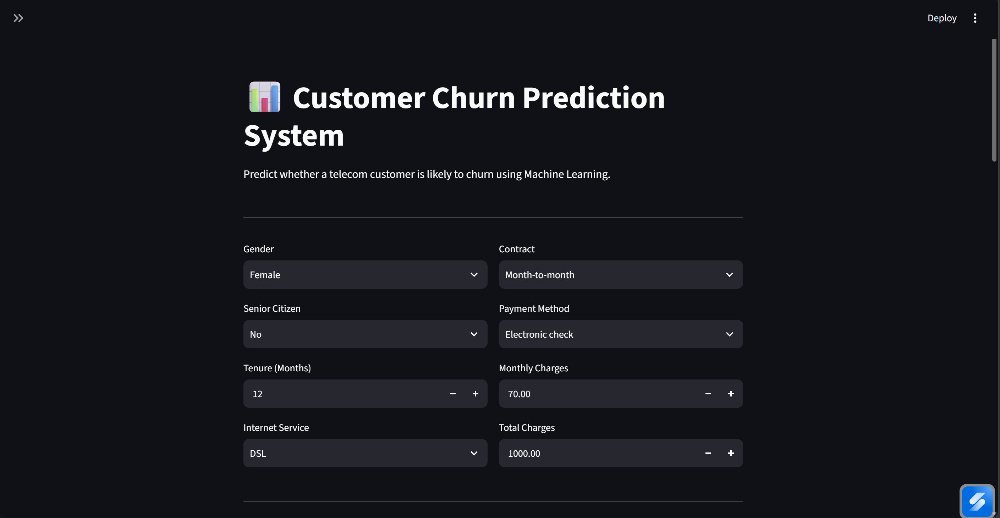
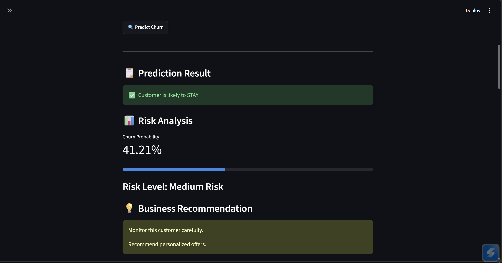
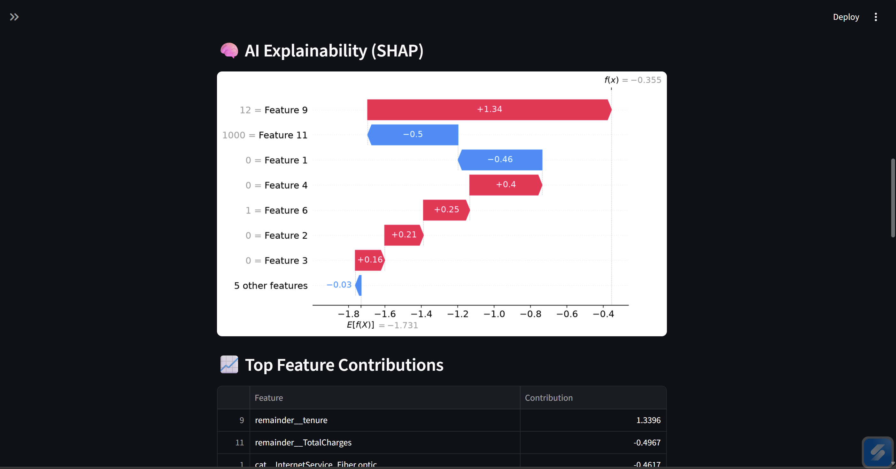
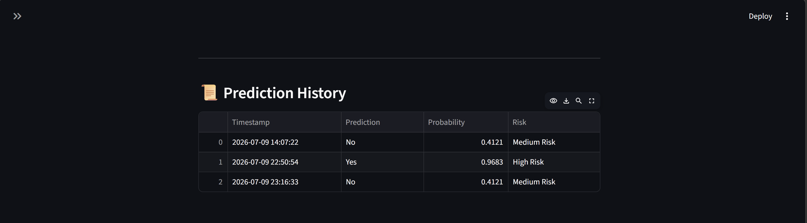
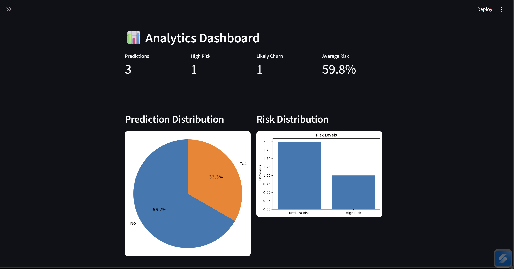

# Customer Churn Prediction System

🚀 Live Demo:
https://customer-churn-prediction.streamlit.app

🐳 Docker Supported

🤖 Explainable AI (SHAP)

📊 Streamlit Dashboard

## Overview

This project is an AI-powered Customer Churn Prediction System developed using Machine Learning and Streamlit.

The application predicts whether a telecom customer is likely to leave the company based on customer information such as contract type, internet service, payment method, tenure, and monthly charges.

The system also provides AI explainability using SHAP values, allowing users to understand why the model made a prediction.

---

## Features

- Customer churn prediction
- Probability score
- Risk level classification
- SHAP AI Explainability
- Prediction history
- Analytics dashboard
- Interactive Streamlit interface
- Dockerized deployment
- Public deployment using Streamlit Community Cloud

---

## Machine Learning Model

Model:

- Logistic Regression

Evaluation Metrics:

- Accuracy
- Precision
- Recall
- F1 Score
- ROC-AUC

---

## Technologies Used

- Python
- Pandas
- NumPy
- Scikit-learn
- Streamlit
- SHAP
- Matplotlib
- Joblib
- Docker

---

## Project Structure

```
Customer_Churn_Prediction/

├── app/
│   └── app_v2.py
│
├── data/
│
├── history/
│
├── models/
│
├── notebooks/
│
├── reports/
│
├── src/
│
├── requirements.txt
├── Dockerfile
├── README.md
```

---

## Installation

Clone the repository

```bash
git clone https://github.com/Hashini-gitch/Customer_Churn_Prediction.git
```

Move into the project

```bash
cd Customer_Churn_Prediction
```

Create virtual environment

```bash
python -m venv .venv
```

Activate virtual environment

Windows

```powershell
.venv\Scripts\activate
```

Install dependencies

```bash
pip install -r requirements.txt
```

Run the application

```bash
streamlit run app/app_v2.py
```

---

## Docker

Build Docker image

```bash
docker build -t customer-churn-app .
```

Run Docker container

```bash
docker run -p 8501:8501 customer-churn-app
```

Then open

```
http://localhost:8501
```

---

## AI Explainability

This project uses SHAP (SHapley Additive Explanations) to explain individual predictions.

Instead of using manually written business rules, the application shows which features contributed the most to each prediction.

---

## Screenshots

### Home Page



---

### Prediction Result



---

### SHAP Explainability



---

### Prediction History



---

### Analytics Dashboard


---


## Future Improvements

- Deep Learning model
- XGBoost model
- Customer segmentation
- Model monitoring
- CI/CD pipeline
- Cloud deployment

---

## Author

**Hashini Avishka**

Data Science Undergraduate

SLIIT

GitHub:https://github.com/Hashini-gitch


LinkedIn:https://www.linkedin.com/in/hashini-a-rathnayake-2a8ba235b
